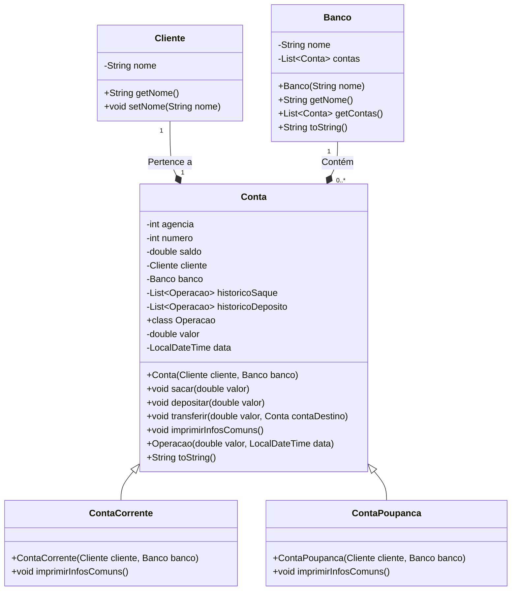

# Sistema Bancário em Java

Este repositório é a solução para o desafio de projeto: Criando um Banco Digital com Java e Orientação a Objetos, do Bootcamp Bradesco - Java Cloud Native da [DIO](https://www.dio.me/), que consiste em criar um sistema bancário simples, que permite a criação de contas correntes e poupanças, realização de depósitos, saques e transferências, além de registrar o histórico de operações com data e hora.

## Funcionalidades

- Criação de clientes, contas correntes e contas poupança.

- Realização de depósitos, saques e transferências entre contas.

- Registro do histórico de operações (saques e depósitos) com data e hora.

- Exibição de informações das contas, incluindo saldo e histórico de operações.

## Diagrama de Classes

Abaixo está o diagrama de classes do sistema:



## Como Executar
1. Clone o repositório:
```bash
git clone https://github.com/seu-usuario/sistema-bancario-java.git
```
2. Navegue até o diretório do projeto:
```bash
cd sistema-bancario-java
```
3. Compile e execute o código:
```bash
javac Main.java
java Main
```